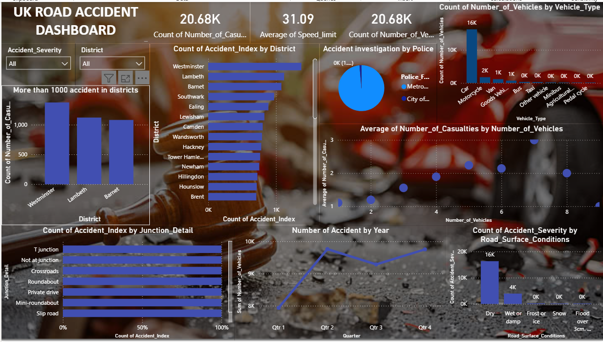

# UK Road Accident Analysis Dashboard

This project analyzes UK road accident data using Power BI.

## Dashboard Preview

## Dataset
- data UK_Road_Accident.xlsx

## Dashboard File
- UK Road Accident Dashboard.pbix

## Key Insights
- 20K+ accidents analyzed
- High accident districts identified
- Junctions have more accidents
- Dry road conditions dominate

## Tools Used
- Power BI
- DAX
- Data Analysis
